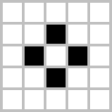

# Conway's Game of Life - Pygame Implementation

Welcome to the Conway's Game of Life implementation in Pygame! This repository provides a graphical representation of Conway's Game of Life, a cellular automaton devised by mathematician John Conway.

---

    

A single Gosper's glider gun creating gliders

---

## Table of Contents

- [Introduction](#introduction)
- [Rules of the Game](#rules-of-the-game)
- [Examples](#examples)
- [Features](#features)
- [Future Updates](#future-updates)
- [License](#license)

## Introduction

Conway's Game of Life is a classic zero-player game that simulates the evolution of a grid of cells based on a simple set of rules. This implementation brings the Game of Life to life in a graphical interface using Pygame.

## Rules of the Game

The game is played on a two-dimensional grid of cells, each of which can be in one of two states: alive or dead.

The rules for each generation are as follows:
1. Any live cell with fewer than two live neighbors dies, as if by underpopulation.
2. Any live cell with two or three live neighbors lives on to the next generation.
3. Any live cell with more than three live neighbors dies, as if by overpopulation.
4. Any dead cell with exactly three live neighbors becomes a live cell, as if by reproduction.

These rules create fascinating patterns and behaviors as the simulation progresses.

## Examples

Here are some examples of patterns that can emerge in the Game of Life:

1. **Still Lifes:** Patterns that do not change from one generation to the next.
   

     
    
    
   

   
Boat and Tub - Still Life

    

2. **Oscillators:** Patterns that repeat after a certain number of generations.
   

     
    
    
   

   
Toad and Pulsar - Oscillators

    

3. **Spaceships:** Patterns that move across the grid.
   

     
    
    
   

   
Light and Heavy weight - Spaceships

    

4. **Glider:** A common spaceship that moves diagonally.
   

     
    
   

   
Glider - Common Spaceship

## Features

- **Graphical User Interface:** The implementation includes a Pygame-based GUI for interactive gameplay.
- **Simulation Controls:** You can control the simulation with features like fast forward, step-by-step execution, and rewind.
- **Sandbox Level:** The initial version of the game provides a sandbox level where you can apply the original rules.
- **Scoring System:** Upcoming versions will introduce a scoring system to track your progress in different levels.
- **Additional Levels:** Future updates will add various levels with different rule sets and challenges.

## Future Updates

This project is under active development, and future updates will include:

- **Additional Levels:** Introducing different levels with unique rules and challenges.
- **Scoring System:** Adding a scoring system to track your progress and achievements.
- **Improved GUI:** Enhancing the user interface with more features and customization options.

Stay tuned for exciting new features and improvements!

## License

This project is licensed under the MIT License - see the [LICENSE](LICENSE) file for details.
